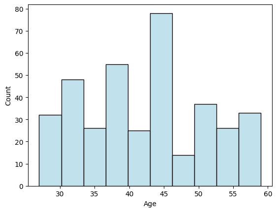
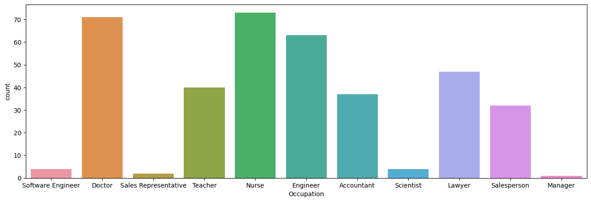
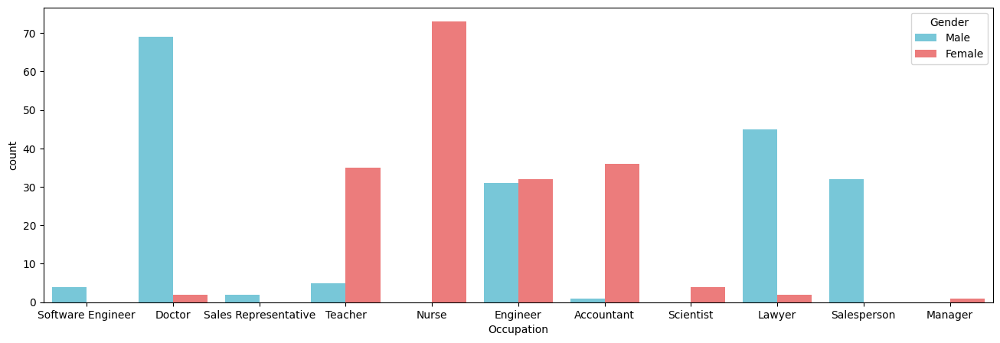
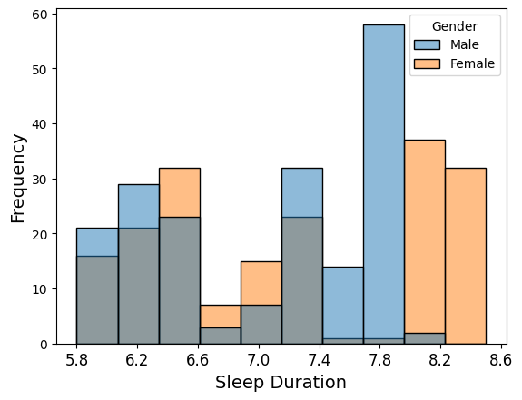
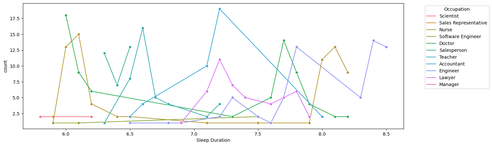
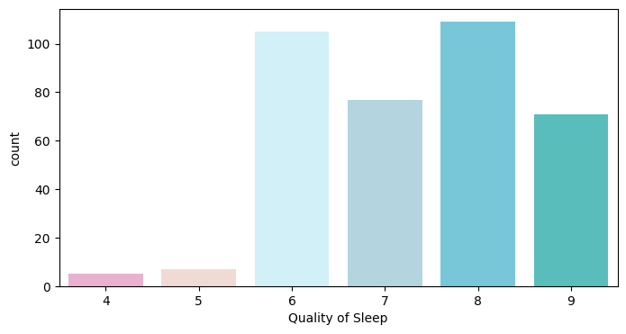
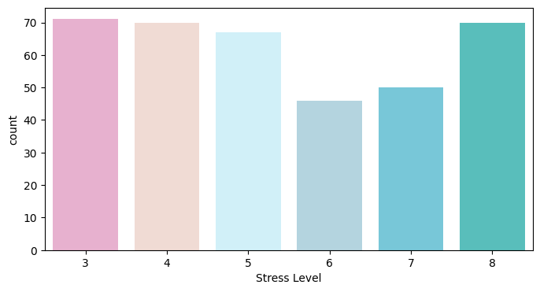
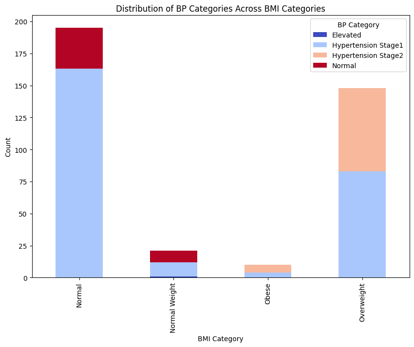
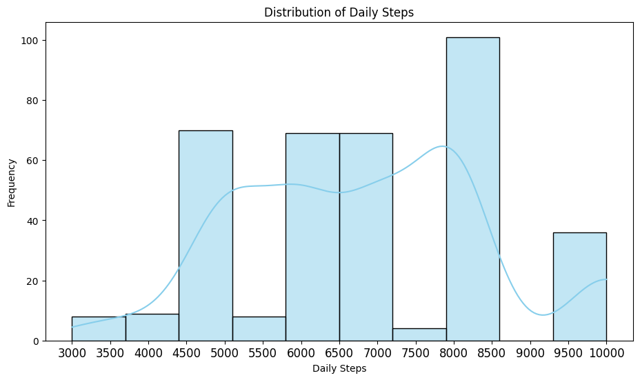
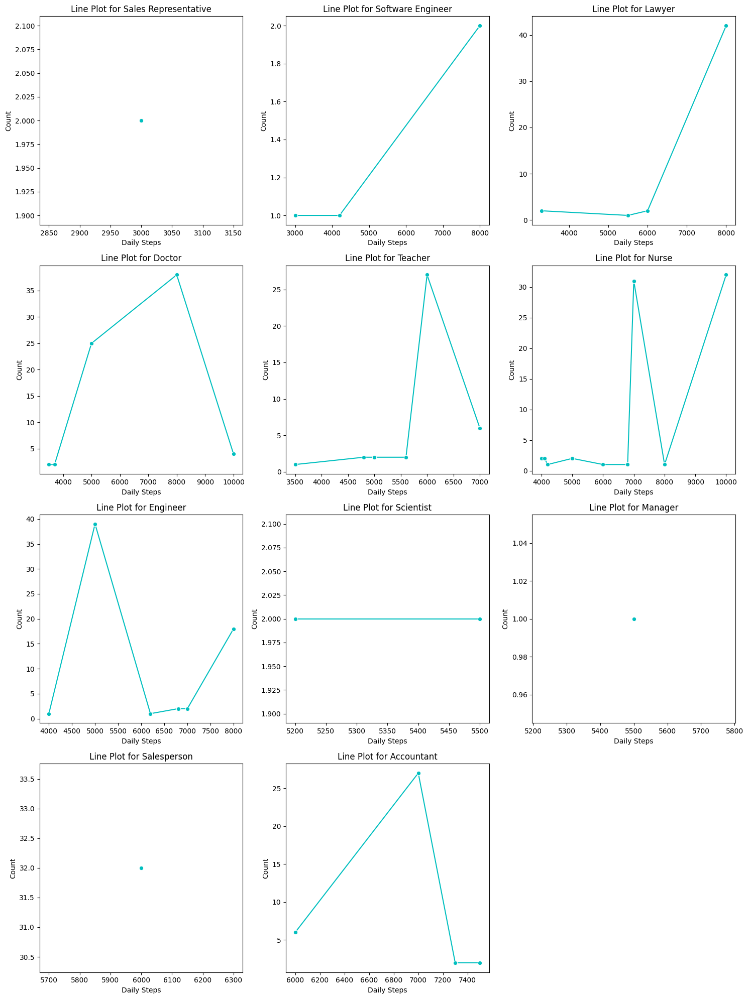

# 💤 Sleep Health & Lifestyle Analysis  
Comprehensive Exploratory Data Analysis (EDA) on Sleep Health and Lifestyle dataset to understand how lifestyle habits, physical activity, stress, BMI, and vital parameters affect sleep quality and sleep disorders.

---

## 📁 Project Structure


---

## 📦 Dataset Overview  
The dataset contains **sleep, health, and lifestyle attributes** for 374 individuals. It includes:

- Gender  
- Age  
- Occupation  
- Sleep Duration  
- Sleep Quality  
- Stress Level  
- Physical Activity  
- Heart Rate  
- Blood Pressure  
- BMI Category  
- Daily Steps  
- Sleep Disorder (None / Insomnia / Sleep Apnea)

---

## 🔧 Technologies Used  
- Python  
- Pandas  
- NumPy  
- Matplotlib  
- Seaborn  
- Jupyter Notebook  

---

## 🧼 Data Cleaning & Preparation  
The notebook performs:

✔ Handling numerical/categorical columns  
✔ Checking missing values  
✔ Deriving summary statistics  
✔ Visualizing relationships between sleep and lifestyle factors  

---

# 📊 Visualizations & Results

Below are all the visualizations extracted from your notebook.

---

## 🧍 Demographics & Distribution Plots  

### **Gender Distribution**
/image_16_0.png)

---

## ⏱️ Sleep Duration & Quality

### **Sleep Duration Distribution**


### **Sleep Quality Distribution**


---

## 🧠 Stress & Activity Levels

### **Stress Levels**


### **Physical Activity Levels**


---

## ❤️ Health Indicators

### **Heart Rate Distribution**


### **BMI Category Count**


### **Blood Pressure Plot**


---

## 🚶 Daily Steps

### **Steps Distribution**


---

## 💤 Sleep Disorder Analysis

### **Sleep Disorder Count**


### **Sleep Disorder vs Sleep Quality**


---

## 🔗 Correlation Analysis

### **Correlation Heatmap**


---

## 📈 Pairwise Visualizations

### **Pairplot Sample**


---

## 📉 Additional Plots (Full EDA)

Below are all remaining extracted charts for completeness:

  
  
  
  
  
  
  
  
  
  
  
  
  
  
  
  
  


---

# 📌 Key Insights

### 🔹 Sleep Quality is strongly influenced by:
- Higher **stress levels** → lower sleep quality  
- Higher **physical activity** → better sleep quality  
- Increased **daily steps** → improved sleep patterns  

### 🔹 Sleep Disorders correlate with:
- Higher BMI categories  
- Higher stress  
- Lower sleep duration  

### 🔹 Active individuals have:
- Lower stress  
- Better sleep quality  
- Fewer sleep disorders  

---

## ▶️ How to Run This Project

```bash
git clone https://github.com/latha2024/Sleep-health-lifestyle-dataset/.git
cd Sleep-health-lifestyle-dataset
pip install -r requirements.txt
jupyter notebook

